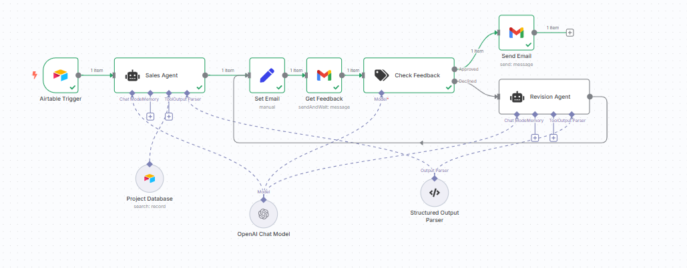

# Human In The Loop Sales Team

An end-to-end AI-powered sales outreach workflow built with n8n, designed to generate, review, refine, and approve personalized sales emails using a Human-in-the-Loop approach — all without writing a single line of code.

This project focuses on workflow architecture, controllability, and real-world usability, not just AI-generated content.

---

## 🚀 Key Features

- 🤖 AI Sales Agent for personalized email generation
- 👤 Human review & feedback loop for quality control
- ✍️ AI Editor Agent that iterates based on human feedback
- 🔁 Approval loop until email meets required standards
- 📧 Ready-to-send, fully approved outreach emails
- 🧩 No-code implementation using n8n only
- 
---

## 🧠 Workflow Overview

---

### Step-by-step workflow
- **A salesperson creates a personalized email**
- **Someone reviews and provides feedback**
- **A proofreader makes adjustments based on the feedback**
- **This loop continues until the email is approved and ready to send**

---

### Demo

---

## 👤 Author

**Phan Quoc Anh**  
Automation / Data / AI Engineer  
